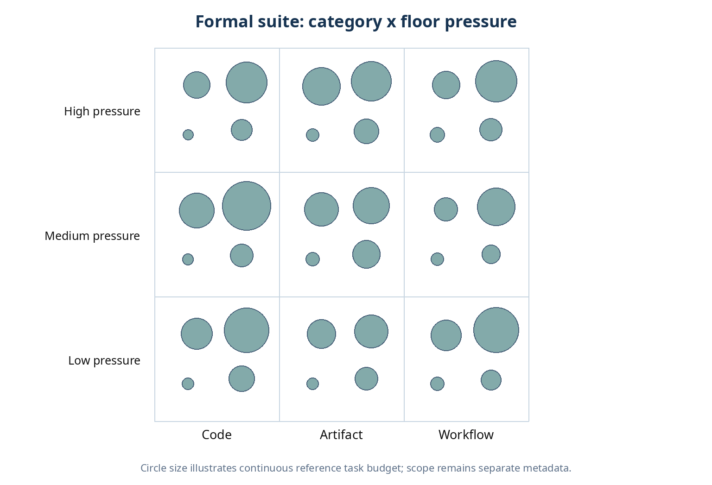
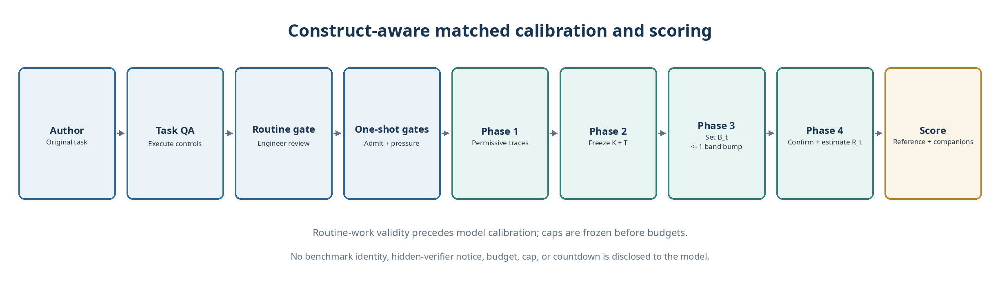
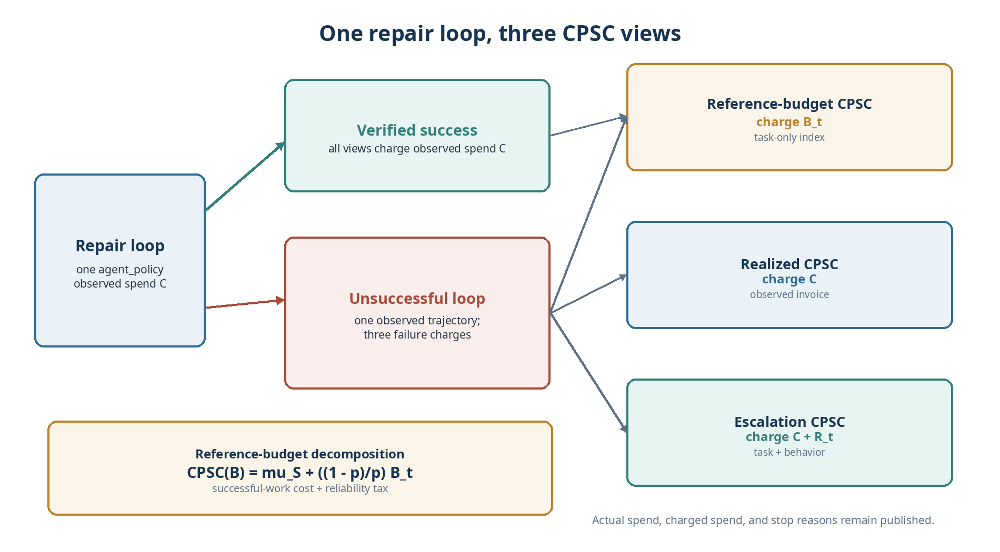

# ShallowSWE: Measuring Reference-Budget Cost per Verified Completion on Routine Software Work

**Methodology White Paper - Freeze Candidate v0.4.2**
**George Lydakis**
**July 2026**

> **Freeze candidate and implementation status.** This paper defines the intended v0.4.2 protocol. Section 1.3 separates implemented, partial, and proposed components using the repository audit dated July 11, 2026; publication requires replacing that date with an exact commit SHA.

ShallowSWE is an independent benchmark inspired by the rigor of DeepSWE. It is not affiliated with DeepSWE, SWE-bench, SWE-Lancer, Datacurve, Harbor, Pier, or their authors.

## Abstract

Software-engineering benchmarks usually ask whether agents can solve difficult tasks. ShallowSWE targets a complementary regime: original, routine, functionally verifiable work that a frozen frontier reference agent should usually complete, but that model configurations may complete with very different amounts of inspection, repair, token use, and API spend. Each scored row uses one immutable model configuration, one fixed agent policy, an isolated reproducible sandbox, and one bounded stateful repair loop.

The headline metric is **reference-budget cost per successful completion**, \(\operatorname{CPSC}^{B}\). Each task receives a frozen reference budget \(B_t\) under the final supervision and liveness policy. Successful rows are charged canonical list-price-equivalent spend; failed rows are charged \(B_t\). For solve probability \(p\) and mean successful spend \(\mu^S\), the task-level population estimand is

\[
\operatorname{CPSC}^{B}=\mu^S+\frac{1-p}{p}B_t,
\]

the cost of successful work plus a reliability tax priced by the task's reference budget. Fresh anchor confirmation also estimates a reference-anchor replacement cost \(R_t\). ShallowSWE publishes realized CPSC and escalation CPSC beside the headline, separates category, empirical pressure, budget, and structural scope, and admits tasks only after independent routine-work and verifier-quality review. A six-task protocol-validation pilot precedes any report-grade snapshot; the proposed 36-task design provides initial within-suite evidence rather than unrestricted population coverage.

## 1. Introduction

Language-model agents increasingly work inside repositories: locating code, editing files, running commands, interpreting failures, and iterating until a requested state is reached. SWE-bench established repository-level issue resolution as an executable evaluation problem [2]. DeepSWE, ShallowSWE's closest methodological reference, strengthens that tradition with original long-horizon tasks, purpose-built functional verifiers, broad repository coverage, a fixed harness, and published trajectories [1]. SWE-Lancer connects verified real-world freelance work to actual payouts, showing why software-engineering evaluation also needs an explicit account of economic meaning [3].

ShallowSWE studies a different slice of software work: regression fixes, compatibility changes, report transformations, configuration repairs, branch operations, and bounded tool workflows. In this regime many configurations may eventually succeed, yet differ sharply in premature completion, repair cycles, context appetite, and cost. One-shot scoring misses that behavior; unbounded retries make persistence arbitrary and can turn hidden verification into an oracle. ShallowSWE therefore evaluates one bounded, stateful repair loop in which the same policy continues after coarse rejection.

The central question is:

> **For a declared workload basket, how much reference-budget cost is charged per verified completion when one fixed agent policy handles every ticket?**

### 1.1 Metric at a glance

For model policy \(m\) on task \(t\), let \(p_{m,t}\) be solve probability, \(\mu^S_{m,t}\) mean spend conditional on success, and \(B_t\) the frozen reference budget. Then

\[
\operatorname{CPSC}^{B}_{m,t}
=\mu^S_{m,t}+\frac{1-p_{m,t}}{p_{m,t}}B_t.
\]

Suppose \(B_t=\$0.20\). Configuration A succeeds 90% of the time and costs \(\$0.04\) when successful:

\[
0.04+\frac{0.10}{0.90}(0.20)=\$0.0622.
\]

Configuration B succeeds every time but costs \(\$0.08\). A is cheaper under the reference-budget policy, although a separate reliability floor may make it ineligible for recommendation. **Realized CPSC** retains actual failed spend. **Escalation CPSC** charges actual failed spend plus the independently estimated reference-anchor replacement cost \(R_t\). The three views show whether a recommendation depends on the failure convention.

### 1.2 Contributions

This paper contributes:

1. **Original routine-work evaluation with an independent construct gate.** Realism is reviewed before model calibration.
2. **A bounded, stateful, naturalistic repair loop.** One fixed policy continues in the same conversation and sandbox after coarse rejection without benchmark or cap disclosure.
3. **Reference-budget CPSC.** Successful-work efficiency and a task-only reliability tax remain in one sortable dollar-denominated index.
4. **Matched calibration.** Permissive trajectories freeze supervision and liveness before task budgets are selected, followed by fresh confirmation under the exact policy.
5. **Explicit companion economics.** Reference-budget, realized, and escalation CPSC are published together.
6. **Auditable scope and evidence.** Category, pressure, budget, and scope remain separate; counterfactual sensitivities are reported only when identified by observed continuation or rerun.

### 1.3 Implementation boundary

The table records the repository state reported by an external code audit supplied by the author on **July 11, 2026**. The audit reported a clean worktree and 149 passing unit tests.

| Component | Status | Repository evidence and boundary |
|---|---|---|
| Stateful same-context repair loop | Implemented | The controller resumes the same agent trajectory and workspace after sanitized verifier rejection. |
| Verifier isolation | Implemented | Hidden verifier artifacts are removed from agent-visible state between checks. |
| Candidate task corpus | Partial | Thirty-six official candidates exist; the audit reported 0/36 fully calibrated and 1/36 with complete task-quality evidence. |
| Reference-budget and escalation metrics | Proposed | The current aggregator computes actual-spend CPSC, corresponding to realized CPSC; \(B_t\), \(R_t\), and charged-spend fields are absent. |
| Pressure versus scope taxonomy | Partial | The paper separates them; repository validation and weighting still use `small`, `medium`, and `large`. |
| Immutable configuration identity | Proposed | Current aggregation can merge rows that differ in provider route, sampling, scaffold, or resolved model. |
| Calibrated caps and budgets | Proposed | Current previews use fixed \(\$5\), 20-submission, and 120-step limits. |
| Provider and price provenance | Partial | Canonical repricing exists, but provider identity and cost reconciliation remain incomplete for some rows. |
| Prototype evidence | Implemented as plumbing evidence | The cited preview extensions contain 753 successes in 756 loops across 18 tasks and 14 configurations. |
| Statistical and rank-stability suite | Proposed | The v0.4.2 estimands, censoring rules, alternative-anchor analyses, and sensitivity outputs remain to be implemented. |

The next empirical milestone is a six-task protocol-validation pilot, not another expansion of the methodology.

## 2. Scope and Design Principles

### 2.1 Measurement unit

ShallowSWE measures reliability and API-cost efficiency for one **fixed agent policy** performing routine, verifiable software work. Each scored row binds one immutable `model_config_id` and `agent_policy_id`; the model, provider route, sampling settings, scaffold, prompt, tools, and continuation behavior remain fixed for the full trajectory. Each run starts in a clean sandbox and ends at verified success or a scored terminal condition.

The result is properly interpreted as **model configuration x agent policy x provider path x snapshot**. It is not a universal intelligence ranking, a comparison of vendors' native coding products, a production router, a task-value estimate, or an ultra-long-horizon autonomy benchmark.

### 2.2 Design principles

**Naturalistic interaction.** The agent receives the task and ordinary scaffold prompt. Benchmark identity, hidden-verifier existence, budgets, caps, and countdowns are not disclosed.

**Implementation-flexible functional verification.** Hidden checks target observable behavior and public contracts. Materially different valid implementations pass.

**Construct validity before calibration.** Frontier success establishes frontier reach; independent engineer review establishes whether a task plausibly represents routine delegated work.

**Explicit economic semantics.** Canonical list-price-equivalent dollars are the cross-model currency. Actual and charged spend are stored separately.

**Pre-registration and reproducibility.** Panels, task gates, price sheets, caps, budget bands, rollout counts, weights, identities, and uncertainty procedures freeze before the corresponding report-grade run. Each public snapshot records the artifacts needed to reproduce it.

## 3. Related Work

### 3.1 Repository-level software-engineering benchmarks

SWE-bench established the modern repository-level issue-resolution setting with 2,294 tasks drawn from GitHub issues and corresponding pull requests across twelve Python repositories [2]. Its repository-plus-issue-plus-executable-test format became the basis for a broad family of software-engineering evaluations.

Mining merged fixes enables scale, but public issues, patches, and tests may enter pretraining data, and tests written to validate one historical patch are not necessarily ideal graders of arbitrary future implementations. Later benchmarks respond through held-out collection, human review, stronger tests, multilingual coverage, or original task authoring.

### 3.2 DeepSWE

DeepSWE is ShallowSWE's closest methodological reference and an explicit source of inspiration. It contains 113 original, long-horizon tasks spanning 91 repositories and five languages. Tasks are written from scratch, verifiers are purpose-built around requested functionality, mini-swe-agent is held fixed across model configurations, and benchmark artifacts and trajectories are released [1].

ShallowSWE adopts the same broad commitments - original work, implementation-flexible functional verification, standardized scaffolding, trajectory transparency, and rigorous task quality - while targeting the opposite end of the task spectrum. DeepSWE asks whether frontier agents can complete large, difficult engineering changes. ShallowSWE asks which fixed configuration is economical on work intended to be reliably within frontier reach.

This contrast also motivates a distinction central to ShallowSWE: **structural horizon is not the same as empirical pressure or economic scale**. A broad mechanical task can be low pressure but costly because it requires substantial context and repeated edits. A narrow bug can be high pressure but inexpensive when solved. ShallowSWE therefore records structural horizon as metadata rather than using it as the primary pressure definition.

### 3.3 Economic software-engineering evaluation and SWE-Lancer

SWE-Lancer evaluates 1,488 real freelance tasks from the Expensify repository that were posted on Upwork and collectively paid one million dollars [3]. Its 764 individual-contributor tasks range from short bug fixes to feature work that took weeks and are graded with hidden end-to-end browser tests written and triple-verified by professional software engineers. Its 724 management tasks ask models to choose among real implementation proposals. The benchmark publishes a Diamond split while retaining a private holdout.

SWE-Lancer is the closest economic comparator to ShallowSWE, but the measured quantities differ. SWE-Lancer maps successful work to **task-side historical payout**. ShallowSWE measures **model-side completion cost and reliability** under a frozen policy. The reference task budget \(B_t\) is an upper allowance and task-only failure charge, while the reference-anchor replacement cost \(R_t\) estimates the expected model spend of obtaining a verified completion from the anchor policy. Neither quantity estimates labor-market value.

ShallowSWE adopts three lessons from SWE-Lancer: source tasks from recognizable paid engineering work, invest in implementation-flexible end-to-end verification and independent review, and separate public development material from held-out evidence. It does not adopt payout as a difficulty label, managerial proposal selection, or public historical fixes as official task sources. SWE-Lancer itself cautions that its tasks come from one repository and that public issues may be contaminated; ShallowSWE instead authors original public tasks and keeps transcript-mined real cases private until publication decisions are made.

## 4. Benchmark Overview

ShallowSWE separates four properties often collapsed into “task size.” The formal suite is organized by category and empirical floor pressure. Reference budget and structural scope remain continuous properties used for coverage, analysis, and sensitivity.



### 4.1 Category

- **Code:** change software behavior, including bug fixes, regression tests, features, refactors, API compatibility, and CLI or UI behavior.
- **Artifact:** transform local inputs into checked outputs, including reports, reconciliations, migrations, summaries, structured files, and data packages.
- **Workflow:** operate on repository, tool, or system state, including git operations, configuration chains, local mock APIs, tickets, and idempotent reconciliation.

### 4.2 Floor pressure

A frozen economical panel attempts every quality- and construct-valid candidate in one-shot mode. The primary floor configuration's first-submit pass rate assigns a snapshot-relative pressure band. The current candidate bands are:

| Floor pressure | Primary floor one-shot pass rate | Interpretation |
|---|---:|---|
| Low | 70-100% | Usually solved directly by the economical reference |
| Medium | 30-70% | Separates configurations through repair work and spend |
| High | 0-40% | Often strains economical configurations but remains frontier-solvable |

The six-task pilot determines whether two or three bands provide stable separation before the report-grade protocol freezes. After freeze, calibration may assign, flag, or reject; it does not alter task semantics to force a desired band.

### 4.3 Reference budget and replacement cost

Each accepted task receives two anchor-derived quantities under the final repair policy:

- \(B_t\), the **reference task budget**, is a coarse allowance band and the headline failure charge.
- \(R_t\), the **reference-anchor replacement cost**, is total fresh-confirmation anchor spend divided by anchor successes.

A task may be low pressure and high budget, or high pressure and low budget. The benchmark does not force a correlation.

### 4.4 Structural scope and horizon

Scope metadata may include repository and relevant-context size, files inspected and changed, requirements, output artifacts, input volume, expected engineer time, observed steps, and peak context. Scope describes how much state must be traversed; it is neither pressure nor budget.

### 4.5 Coverage target, not quota

The proposed `3 categories x 3 pressure bands x 4 tasks` design is a coverage target. Each intended cell receives a predeclared candidate-authoring budget. If credible routine tasks do not fill a cell, the snapshot reports the cell as undercovered or empty. It does not relax thresholds, expand tasks to manufacture pressure, or silently upweight the surviving tasks. Before the report-grade freeze, pilot evidence may reduce the design to two pressure bands; after freeze, missing coverage remains visible.

## 5. Task Sampling, Construction, and Quality Assurance

### 5.1 Sampling frame

ShallowSWE maintains a versioned catalog of recurring delegated work: localized bug repair, compatibility maintenance, feature wiring, data and report generation, configuration tracing, repository state changes, and bounded tool workflows. Each task records its source pattern, domain, maintenance type, ecosystem, expected engineer effort, and delegation rationale.

The public protocol-validation corpus is synthetic and concentrated in Python. A private companion corpus preserves transcript-mined real repository work as a held-out sourcing lane. Neither lane is a probability sample of software engineering, and claims remain within-suite until later snapshots broaden authorship, ecosystems, repositories, and task sources.

### 5.2 Routine-work construct gate

Before model calibration, every candidate is reviewed by **at least one qualified reviewer who is not the task author**. The predeclared rubric covers:

- realism of the request and repository state;
- frequency in ordinary engineering practice;
- plausibility as delegated work without synchronous clarification;
- ambiguity and missing-context risk;
- expected experienced-engineer effort;
- specialized knowledge required;
- short-horizon, broad-horizon, and frontier-easy distinctions.

The review, rationale, and reviewer count are published. Additional reviewers may be used; when they are, disagreement is reported. Excessively ambiguous tasks are revised or rejected.

### 5.3 Task sourcing and contamination boundaries

**Original-authoring lane.** Instructions, fixtures, verifiers, and solutions are written from scratch. Public repositories and benchmarks may inspire abstract patterns, but no task adapts a public issue, patch, benchmark instance, or gold solution.

**Private real-case lane.** Private Codex, Claude, or Cursor transcripts may identify authentic bug fixes, reviews, artifacts, and workflows in repository-scale codebases. The source transcript and historical solution are discovery and reconstruction evidence, not calibration or scoring evidence. Each promoted task records the source model and session, reconstructs a clean before-state, uses a deterministic implementation-flexible verifier, and receives fresh model runs under the frozen protocol. A model that produced the historical solution is not credited with a benchmark success from that trajectory, and source-model correlation is reported as a threat to validity.

For a cost benchmark, contamination can lower both failure rate and trajectory length. Public snapshots therefore either use original tasks or disclose the held-out real-case sourcing and contamination controls applied to every included task.

### 5.4 Task package

```text
tasks/<task-id>/
  task.toml
  instruction.md
  environment/
  tests/
    test.sh
  solution/
  solution_alt/
  quality/
    requirements.json
    negative-controls.json
    routine-review.json
```

The agent sees the instruction and repository state, not the verifier, solutions, quality evidence, calibration data, or benchmark metadata. The execution backend may use containers, chroot plus seccomp, or another pinned isolation mechanism.

### 5.5 Functional verifier contract

Verifiers are deterministic and programmatic. Every hidden assertion maps to a visible requirement or public repository contract. Alternate valid implementations must pass; no-op patches, hardcoded fixtures, partial solutions, malformed outputs, and destructive overreach must fail. The snapshot discloses the feedback classes the active runner actually propagates.

### 5.6 Executed quality evidence

Before calibration, each task must execute:

1. prompt-verifier consistency checks;
2. reference and materially different alternate solutions;
3. no-op and negative controls;
4. visible-example and hidden-expectation checks;
5. feedback leakage review;
6. clean-sandbox reproducibility.

The audit records commands, environment identity, exit status, and artifact hashes. Declarations without execution are incomplete evidence.

### 5.7 Candidate funnel

Every snapshot publishes counts and reasons for:

```text
patterns considered
-> candidates authored
-> construct-gate rejects
-> quality-gate rejects
-> ceiling-gate rejects
-> pressure-unstable candidates
-> accepted tasks
```

A semantic revision informed by model behavior creates a new task version and returns to the beginning of the funnel.

## 6. Calibration

Calibration freezes admission, pressure, verifier supervision, liveness guards, and the task-budget constants described below. Construct and quality gates precede model runs; caps freeze before budgets; fresh anchor runs confirm the final policy.



### 6.1 Frozen panels

Each snapshot pre-registers a **primary frontier anchor**, at least one **secondary frontier anchor**, a cheaper **floor-probe panel**, and a later **leaderboard panel**. The primary anchor defines the canonical snapshot. Secondary anchors test sensitivity; they are not per-task fallbacks.

Requested model configurations, provider routes, sampling settings, and agent policies freeze before any canary row intended as official evidence. The canary validates resolved identity and accounting; it does not select the configuration after observing outcomes. A requested/resolved mismatch invalidates the affected rows and requires a versioned manifest before rerun.

### 6.2 Admission and pressure

Candidates first pass construct and executed quality review. The primary anchor then runs in one-shot mode. The provisional v1 gate remains at least 12/16 successes plus verifier review. The floor panel assigns pressure from first-submit performance; material disagreement among floor configurations triggers review.

The six-task protocol-validation pilot does not perform a separate report-grade admission batch. It derives a descriptive first-submit statistic from the pre-feedback prefix of permissive trajectories, provided that mode and caps remain undisclosed and the model configuration, prompt, scaffold, tool policy, seed allocation, and initial filesystem state match. This demonstrates measurement plumbing and tests for useful signal; it does not satisfy the v1 `N=16` admission gate or freeze report-grade pressure labels.

### 6.3 Phase 1: permissive development collection

The anchor and floor panel run under generous temporary submission, step, and safety-dollar limits using the intended scaffold, feedback, sandbox, and accounting. No limit is disclosed to the agent. The collection records cumulative spend, submissions, steps, outcomes, and first successful verification.

Because the cap is undisclosed, a trajectory prefix through submission \(k\) is valid evidence for any later policy that stops at or before that point.

### 6.4 Phase 2: freeze submission and step policies

The global hidden-verifier cap \(K\) is the smallest coarse value after which additional feedback yields negligible additional legitimate success across the pre-registered calibration panel, subject to a hard maximum.

The step cap \(T_g\) is a pooled, high liveness guard estimated over a sufficiently large group such as category x pressure or the full calibration corpus. It should rarely bind before dollars or submissions. Neither cap is disclosed to the agent.

### 6.5 Phase 3: select the reference task budget

Let \(\mathcal B\) be a pre-registered set of coarse dollar bands and \(\tau_B\) the anchor coverage target. A pre-registered proposal subset of the permissive anchor trajectories selects

\[
B_t^{(0)}=\min\left\{b\in\mathcal B:
\widehat P(\text{anchor succeeds before }b,K,T_g)\ge\tau_B
\right\}.
\]

A separate development-check subset either confirms \(B_t^{(0)}\) or permits one adjacent band increase. If neither band reaches the same \(\tau_B\), the task is revised or rejected. The split, band schedule, and sample sizes freeze before analysis.

### 6.6 Phase 4: fresh confirmation and \(R_t\)

Fresh anchor replicates run under the exact frozen \(K\), \(T_g\), \(B_t\), scaffold, provider route, and price sheet. The same coverage target \(\tau_B\) applies. No budget increase is allowed after confirmation begins.

For an accepted task,

\[
R_t=\frac{\sum_{j=1}^{n_a}C_{a,t,j}}
{\sum_{j=1}^{n_a}Y_{a,t,j}},
\]

where \(C\) is canonical list-price-equivalent anchor spend and \(Y\) indicates success. The snapshot publishes the runs, sample size, and uncertainty for \(R_t\).

### 6.7 Suite selection

Within each category-pressure cell, selection seeks budget and scope spread, multiple task shapes, and independent domains. The report publishes the candidate funnel and correlations among pressure, log budget, and scope.

The protocol-validation pilot chooses whether two or three pressure bands are viable. Once the report-grade design freezes, underfilled cells remain underfilled; tasks are not modified or reweighted to conceal missing coverage. Alternative-anchor analysis reports both reranking on the same suite and changes to admission or suite composition.

## 7. Bounded Repair-Loop Protocol

### 7.1 One continuous run

Each task-policy-replicate row starts from a clean sandbox. The agent works normally and declares completion. The hidden verifier runs only after a valid submission. If verification fails and the undisclosed allowance remains, the same agent continues in the same conversation and filesystem state with sanitized feedback. The loop stops at verified success or a scored terminal condition.

All calls, commands, edits, submissions, usage, and outcomes belong to one immutable policy. No fallback, model switching, ensemble, fresh retry, or transcript handoff occurs inside a scored row.

### 7.2 Naturalistic model-facing contract

The agent is not told that it is in a benchmark, that verification is hidden, how many attempts remain, how much budget remains, or whether a submission is final. ShallowSWE is non-interactive: clarification requests receive no task-specific answer, remain in the transcript, and do not pause the run.

Allowed feedback is coarse, for example:

```text
The requested behavior is not yet satisfied. Continue working.
The run failed because the required artifact is missing.
The submitted result could not be executed.
The submitted output does not match the required contract.
```

The active runner publishes the exact classes it exposes.

### 7.3 Verifier-submission cap

The global undisclosed cap \(K\) limits external correctness feedback. A configuration that would succeed only after submission \(K+1\) fails under the common supervision contract.

### 7.4 Agent-step cap

The step cap catches pathological loops, repeated malformed actions, and cheap trajectories that could otherwise continue indefinitely. It uses one stable scaffold-level step definition and is set high enough to be a liveness guard rather than a routine stopping condition.

### 7.5 Dollar budget and transactional overrun

Task \(t\) uses runtime budget \(B_t\) under the frozen price schedule. Usage is updated after each indivisible model call. The protocol pre-registers how a crossing call is retained and how overrun is recorded. Actual spend remains visible even when a failed row's headline charge is exactly \(B_t\).

### 7.6 Terminal conditions

Scored failures include submission, step, or dollar exhaustion; model-caused context exhaustion after meaningful progress; malformed-action termination; and voluntary give-up or non-submission after meaningful progress.

Wall-time, provider, network, credential, model-resolution, dispatch, sandbox, and verifier-infrastructure failures are excluded and retried unless the trajectory independently demonstrates a genuine model loop. Exclusions and reruns are published.

## 8. Metric Family



### 8.1 Notation and population estimands

For model policy \(m\), task \(t\), and replicate \(i\), let:

- \(Y_{mti}\in\{0,1\}\) indicate verified success;
- \(C_{mti}\) be observed canonical list-price-equivalent model spend observed before stopping;
- \(B_t\) be the frozen reference task budget;
- \(R_t\) be the reference-anchor replacement cost.

Define row charges:

\[
H^{B}_{mti}=Y_{mti}C_{mti}+(1-Y_{mti})B_t,
\]

\[
H^{\mathrm{real}}_{mti}=C_{mti},
\]

\[
H^{\mathrm{esc}}_{mti}=C_{mti}+(1-Y_{mti})R_t.
\]

For metric variant \(v\), the task-level population ratio estimand is

\[
\theta^v_{m,t}=\frac{E[H^v_{m,t}]}{E[Y_{m,t}]},
\]

provided \(E[Y_{m,t}]>0\). The plug-in estimator is

\[
\widehat\theta^v_{m,t}=
\frac{\sum_i H^v_{mti}}{\sum_i Y_{mti}}.
\]

This explicitly separates the estimand from the finite-sample ratio estimator; the estimator is not claimed to be unbiased at small \(N\).

### 8.2 Reference-budget CPSC - headline

The headline is

\[
\operatorname{CPSC}^{B}_{m,t}
=\frac{\sum_i H^{B}_{mti}}{\sum_iY_{mti}}.
\]

Successful rows contribute observed canonical list-price-equivalent spend. Unsuccessful rows contribute the full task budget \(B_t\), regardless of observed failed spend or stop class. Failure charge is therefore a function of the task alone.

Let \(p_{m,t}=E[Y_{m,t}]\) and \(\mu^S_{m,t}=E[C_{m,t}\mid Y=1]\). Then the population ratio decomposes as

\[
\operatorname{CPSC}^{B}_{m,t}
=\mu^S_{m,t}+\frac{1-p_{m,t}}{p_{m,t}}B_t.
\]

The first term is successful-work cost. The second is a reliability tax. The score is dollar-denominated and sortable, but failed rows are charged rather than literally invoiced.

### 8.3 Realized CPSC

Realized CPSC retains actual observed spend for every scored row:

\[
\operatorname{CPSC}^{\mathrm{real}}_{m,t}
=\frac{\sum_i C_{mti}}{\sum_iY_{mti}}
=\mu^S_{m,t}+\frac{1-p_{m,t}}{p_{m,t}}\mu^F_{m,t},
\]

where \(\mu^F=E[C\mid Y=0]\). This corresponds to the current prototype's implemented CPSC. It is the most literal benchmark invoice, but failed-row cost depends on which cap or behavioral endpoint stopped the trajectory.

### 8.4 Escalation CPSC

Escalation CPSC charges the observed candidate attempt and a reference-anchor replacement leg for every candidate failure:

\[
\operatorname{CPSC}^{\mathrm{esc}}_{m,t}
=\frac{\sum_i H^{\mathrm{esc}}_{mti}}{\sum_iY_{mti}}
=\mu^S_{m,t}+\frac{1-p_{m,t}}{p_{m,t}}(\mu^F_{m,t}+R_t).
\]

Here the failure charge depends on both task and candidate behavior. A model that fails quickly and cheaply is preferred to one that burns most of the budget before failing. This is useful for a try-candidate-then-replace analysis, although preserving the candidate-success denominator means it is not itself the literal unit cost of a composite router.

A literal routing-policy analysis should instead simulate the complete candidate-plus-anchor success process and divide total policy spend by policy successes.

### 8.5 Zero-success cells

If a task or aggregation cell has zero successful candidate loops, CPSC is undefined and displayed as **no verified successes**. The cell is not dropped. Charged spend, actual spend, failures, cap reasons, and coverage remain visible, and workload aggregation retains its zero solve-rate contribution.

### 8.6 Reliability eligibility

The provisional v1 recommendation floor is 90% **observed** scored repair-loop solve rate in the relevant weighted slice. It is a benchmark eligibility policy, not a claim that the unknown population reliability has been proven to exceed 90%.

At \(N=10\), 9/10 and 8/10 are separated by the policy despite wide uncertainty. Therefore any row that could affect eligibility or the cost frontier must follow a frozen extension rule - for example, extension to \(N=20\) when the initial result lies near the cutoff or recommendation boundary. A Bayesian or sequential alternative may be adopted, but it must be frozen before scoring. Point estimates and intervals are always reported together.

### 8.7 Required diagnostics

Alongside all CPSC variants, publish:

- solve rate and first-submit pass rate;
- conditional successful spend;
- mean and distribution of verifier submissions to success;
- actual failed spend and failure charge;
- cap-hit and stop-reason taxonomy;
- input, output, cache-read, cache-write, and reasoning tokens;
- turns, scaffold-defined steps, peak context, and latency;
- provider-reported versus canonical reconstructed spend;
- task budget \(B_t\), replacement cost \(R_t\), and their calibration sample sizes.

## 9. Workload Index and Global Ranking

### 9.1 Declared workload basket

The default basket gives equal total weight to each supported category, equal total weight to each supported pressure band within category, and equal weight to tasks within each cell. Exact rational or normalized floating-point weights are used.

For metric variant \(v\),

\[
\Theta^v_m=
\frac{\sum_t w_tE[H^v_{m,t}]}
{\sum_t w_tE[Y_{m,t}]},
\qquad
\widehat\Theta^v_m=
\frac{\sum_t w_t\overline H^v_{m,t}}
{\sum_t w_t\overline Y_{m,t}}.
\]

This is a weighted ratio, not an average of per-task CPSC values. Zero-success tasks remain in the numerator and denominator structure.

If a frozen target cell is underfilled, missing tasks are not imputed or replaced by extra weight on the surviving tasks. The index is labeled a **partial basket**, normalized over observed declared weights, and reports its coverage weight. Protocol-validation pilots normally report task and cell results rather than a global leaderboard.

### 9.2 Interpretation

The report-grade rank answers:

> **If one fixed agent policy handled every ticket drawn from the declared ShallowSWE basket, which eligible policy would incur the lowest reference-budget charge per verified ticket?**

The site decomposes each score into category-pressure and task contributions so that specialization and failure concentration remain visible.

### 9.3 Budget as a continuous dimension

Budget already affects the index through actual spend and task-specific failure charges. Treating budget bins as a third equal-weight matrix would add a strong frequency assumption. Instead, each category-pressure cell seeks credible budget and scope spread; budget-filtered views are alternative baskets.

### 9.4 Contribution decomposition

For each model, publish each task's contribution to charged spend and successful completion. This distinguishes a score dominated by expensive artifact trajectories from one dominated by high-pressure workflow failures.

## 10. Experimental Setup, Claim Tiers, and Prototype Evidence

### 10.1 Agent scaffold

The canonical snapshot holds one scaffold, prompt, tool contract, continuation policy, and sandbox interface constant across the panel. Per-model prompt tuning is not allowed. Alternative scaffolds form separate agent policies.

The protocol binds runner role to evidence class. Kaggle is the primary backend for official metered pilot evidence. Pier/Harbor is the parallel portability and local-reproduction backend; results from a materially different transport or scaffold receive a distinct `agent_policy_id` and are not pooled with Kaggle rows. Codex subscription runs are development-only unless the exact frozen model, route, usage, scaffold, and continuation contract can be proven. Local deterministic execution supplies task QA and harness conformance, not model evidence. Runner provenance is mandatory on every row.

### 10.2 Immutable identities

A display label such as `model[effort]` is insufficient. `model_config_id` hashes canonical JSON covering requested and resolved model, gateway and upstream route, model variant, reasoning effort, complete sampling configuration, context and output limits, cache policy, and transport identity. `agent_policy_id` additionally covers agent and scaffold versions, prompt hash, tool protocol, and continuation policy. Aggregation across unequal IDs is forbidden.

### 10.3 Provider pinning

Panels are pre-registered and provider fallback is disabled. Requested model, resolved model, route, effort, sampling, and cache behavior are recorded per row. Cost claims require complete provider provenance.

### 10.4 Claim tiers and rollout counts

ShallowSWE uses two release classes.

**Protocol-validation pilot.** Six construct-reviewed tasks, two per category, run through canary and permissive collection with the primary anchor and floor panel. One preregistered task per category then completes fresh confirmation, exercising all four calibration phases without claiming task-wide completion. The pilot proposes viable pressure bands, \(K\), step guards, budget bands, and feasible sample sizes. It may include a small diagnostic model panel, but it does not support a global leaderboard claim.

**Report-grade snapshot.** A calibrated suite and frozen leaderboard panel, with fresh anchor confirmation, reference-budget, realized, and escalation metrics, provider reconciliation, eligibility extensions, and pre-registered rank-stability analysis.

The current planning defaults retain \(N=16\) for one-shot anchor admission, \(N=10\) for floor calibration, \(N=10\) initial repair-loop scoring, and \(N=20\) extensions near eligibility or the cost frontier. These are v1 freeze procedures. The protocol-validation pilot demonstrates the full calibration path once at smaller scope; it does not claim to satisfy task-wide report-grade admission, budget selection, or confirmation.

### 10.5 Snapshot production cost

Every release begins with a budget preflight and ends with realized resource accounting. An illustrative profile is:

| Stage | Pilot v0.3 | v1: six / 36 tasks |
|---|---:|---:|
| Infrastructure canary | 16 | as needed |
| Anchor admission + floor calibration | prefix diagnostic | 276 / 1,656 |
| Permissive anchor + floor collection | 72 | 240 / 1,440 |
| Fresh anchor confirmation | 24 on three tasks | 120 / 720 |
| Initial leaderboard scoring | not run | diagnostic / 5,040 |
| **Core official trajectories before extensions** | **112** | **636 / 8,856** |

The pilot's 112 rows exercise every protocol phase while spending task-diversity capital before seed precision. Its current estimate is about **\$43 base and \$63 high**, against a **\$200 cumulative core limit** and separate **\$100 targeted-extension reserve**. Those limits are safety bounds, not expected spend. A full secondary-anchor admission and confirmation pass adds roughly 1,296 trajectories to the 36-task design at these defaults; disputed-cell extensions add a panel-dependent tail. July 2026 planning places report-grade metered value around **\$1,500-\$3,000**, to be replaced by pilot actuals.

Snapshot accounting reports four quantities separately:

- canonical list-price-equivalent model cost;
- realized metered cash outlay;
- subscription, grant, or in-kind compute consumed;
- human review, task-authoring, and infrastructure effort.

### 10.6 Token, dollar, and repricing accounting

Raw provider usage is stored for every response and summed over the loop. Canonical cross-model dollars are reconstructed from a dated price sheet. Gateway-reported charges remain reconciliation diagnostics, with a predeclared tolerance for publication.

A common-price counterfactual reprices candidate and anchor traces, then recomputes \(B_t\), \(R_t\), all metric variants, and rankings. Repricing candidates alone is inconsistent.

### 10.7 Cache policy

Intra-run cache use is priced normally. Cross-run caching is disabled where possible; otherwise order is randomized and cache-hit rates are disclosed. Warm and cold conditions are not mixed in one headline snapshot.

### 10.8 Sandbox and verifier isolation

Every task runs without internet access in an isolated reproducible sandbox. Environment identity, dependency artifacts, filesystem or image digest, and verifier hash are recorded. Hidden assertions, golden outputs, fixture values, and answer-revealing logs never enter the model context.

### 10.9 Current prototype evidence

The prototype demonstrates a working stateful repair loop and multi-model execution path. The cited previews contain 756 scored loops across 18 tasks and 14 configurations, with 753 successes. This validates machinery but is too saturated for strong capability discrimination.

The current repository computes realized CPSC, uses fixed preview caps, retains a `category x size` schema, and has not implemented \(B_t\), \(R_t\), immutable agent-policy identities, or the v0.4.2 sensitivity suite.

## 11. Statistical Analysis, Identifiability, and Reporting

### 11.1 Solve-rate and CPSC uncertainty

Report solve-rate point estimates and binomial intervals for every task and aggregate slice. The 90% recommendation floor is an observed eligibility policy unless a stronger frozen sequential or posterior rule is adopted.

CPSC intervals use resampling that keeps replicates nested within tasks. With a curated suite, these are **suite-composition robustness intervals**, not population coverage claims. \(R_t\) sample sizes and intervals are published and propagated into escalation comparisons when feasible.

### 11.2 Paired model comparisons

Models are paired by task. Compare differences or log ratios using paired task resampling. Do not claim common-random-number pairing by `seed` unless the same variate is passed to and honored by every provider.

For close comparisons, report an interval for

\[
\log\frac{\Theta^B_A}{\Theta^B_B}
\]

and optionally the resampled probability that A is cheaper under the declared suite.

### 11.3 Identifiability of stopped-trajectory counterfactuals

A counterfactual is recoverable only when it requires no unobserved continuation. Retrospective truncation can usually identify lower budgets, lower submission or step caps, and more expensive price schedules. Higher caps, cheaper repricing after dollar exhaustion, and policies that permit work beyond the observed stop require continuation or rerun.

Every sensitivity is labeled **identified by truncation**, **identified by permissive coverage**, **partially censored**, or **rerun required**.

### 11.4 Rank stability by release class

The protocol-validation pilot reports the identified sensitivities needed to propose \(K\), step guards, budget bands, and pressure-band count. It confirms the frozen-policy machinery on one preregistered task per category and does not execute a full alternative-anchor leaderboard. If the permissive collection shows no meaningful first-submit, eventual-success, repair-cost, or feedback-use separation, the pilot stops and improves task coverage rather than buying more seeds.

Every report-grade snapshot publishes stability under:

1. a pre-registered secondary anchor on the same suite;
2. secondary-anchor admission and suite-composition differences;
3. feasible budget and cap variants, with reruns where continuation is missing;
4. current and common-price schedules;
5. reference-budget, realized, and escalation CPSC;
6. plausible workload weights;
7. inclusion and exclusion of weak-confidence tasks.

Recommendations are labeled when they are anchor-, budget-, cap-, price-, workload-, or failure-convention-sensitive.

### 11.5 Required report outputs

A report-grade release includes global metric variants and solve rate; category-pressure frontiers; task contribution and cost-anatomy views; first-submit and eventual success; submission and step distributions; \(B_t\), \(R_t\), sample sizes, and intervals; failure taxonomy; construct ratings and candidate funnel; provider reconciliation; identifiability status; and rank-stability results.

## 12. Hypotheses and Planned Analyses

ShallowSWE is designed to test several hypotheses rather than merely publish a leaderboard.

**H1: Frontier capability rank does not determine routine-work economic rank.** Models that dominate hard benchmarks may carry a price or token-utilization premium that is not justified on routine tasks.

**H2: Repair tax separates near-ceiling models.** Even when eventual solve rates are similar, configurations differ in premature completion, verifier submissions, turns, and charged cost.

**H3: Pressure, budget, and scope are partially independent.** Broad mechanical tasks can be expensive but easy; narrow subtle tasks can be cheap but high pressure.

**H4: Price and token appetite are distinct.** Full-economy repricing can separate list-price premium from token efficiency while keeping candidate spend, \(B_t\), and \(R_t\) consistent.

**H5: A global winner hides meaningful specialization.** Category, pressure, budget, and scope slices may favor different configurations even when one leads the default basket.

**H6: Failure-cost policy can change recommendations.** Reference-budget, realized, escalation, and literal routing-policy analyses may disagree near the frontier.

**H7: Robust findings survive plausible anchor and policy perturbations.** Instability is itself evidence about the benchmark claim.

**H8: Routine-work ratings explain variance not captured by frontier success.** Independent realism, ambiguity, and expected-effort ratings should reveal construct differences among equally frontier-solvable tasks.

## 13. Limitations

### 13.1 Workload and construct validity

The global rank belongs to a declared basket. Independent review improves the “routine work” claim, but a curated, synthetic, Python-heavy suite is not a probability sample of software engineering. Underfilled pressure cells and alternative workload weights remain visible.

### 13.2 Anchor and failure conventions

\(B_t\) and \(R_t\) depend on the anchor, provider route, cache policy, and price sheet. Reference-budget, realized, and escalation CPSC answer different questions; anchor and convention sensitivity are part of the result.

### 13.3 Supervision and scaffold

Generic hidden rejection is supervision, and the submission cap shapes the repair process. A fixed scaffold improves comparability while leaving model-scaffold interaction in the measurement.

### 13.4 Sample size and verification

The initial suite and provisional rollout counts support protocol validation and within-suite comparisons. Budget coverage, \(R_t\), and near-threshold solve rates remain noisy at small N. The benchmark also treats functional verification as authoritative and excludes the cost of building it.

### 13.5 Task aging and implementation maturity

Public tasks lose value for future headline rankings and require new versions or held-out extensions. The stateful loop is implemented, while several v0.4.2 scoring and provenance components remain proposed; the commit-pinned status table is part of every release.

## 14. Reproducibility and Release Policy

A public snapshot releases the exact repository commit; implementation-status matrix; task instructions and sandbox definitions; executed quality evidence; routine-work review and candidate funnel; calibration manifests and decisions; permissive and confirmatory anchor trajectories; per-task \(B_t\) and \(R_t\); immutable identities; row-level actual and charged spend; provider and price provenance; aggregation and uncertainty code; exclusions and reruns; redacted trajectories; and a snapshot manifest containing all hashes and versions.

The release also publishes its claim tier and production accounting. A protocol-validation pilot may defer secondary-anchor leaderboard runs and broad global claims. A report-grade snapshot must satisfy the full scoring, reconciliation, eligibility-extension, and rank-stability requirements.

Transcripts may redact secrets, credentials, machine identifiers, and non-task infrastructure paths, but not model outputs, commands, edits, submissions, or agent-facing feedback.

## 15. Discussion

ShallowSWE keeps one headline while preserving the dimensions beneath it. Category identifies the work, pressure records challenge to an economical reference, \(B_t\) prices the task-only failure charge, \(R_t\) prices reference replacement, and scope records the state traversed.

The design permits inexpensive models to work persistently within the task budget while bounding hidden correctness feedback. Reference-budget scoring compares reliability with a task-only failure charge; realized and escalation views expose stopping behavior and replacement economics. Agreement across these views is stronger evidence than any one ordering.

## 16. Conclusion

ShallowSWE evaluates routine software work that strong agents should usually complete but may complete at very different cost. Its proposed protocol combines original tasks, independent routine-work review, functional verification, one stateful policy per run, matched calibration, and transparent accounting.

The next step is a six-task protocol-validation pilot. It will determine whether the pressure taxonomy is viable, select the remaining constants, measure production cost, and establish whether a report-grade snapshot is practical.

# Appendix A. v0.4.2 Freeze Decision Log

## A.1 Settled protocol

- **Headline:** reference-budget CPSC; successful rows use canonical list-price-equivalent spend and failed rows use \(B_t\).
- **Companions:** realized CPSC and escalation CPSC are published beside the headline.
- **Run identity:** one immutable model and agent policy per row; no fallback, ensemble, judge, or handoff.
- **Runner evidence:** Kaggle is primary for official pilot evidence, Pier/Harbor is the portability path, and Codex subscription trajectories remain development-only unless exact equivalence is proven.
- **Model-facing contract:** no benchmark, verifier, budget, cap, countdown, or final-attempt disclosure.
- **Task construct:** category, pressure, budget, and scope remain separate; routine-work review precedes calibration.
- **Reviewer minimum:** at least one qualified reviewer who is not the task author.
- **Pressure:** measured rather than manufactured; the pilot selects two or three bands before report-grade freeze.
- **Calibration:** permissive collection; freeze \(K\) and \(T_g\); coverage-based budget selection with at most one development-stage band increase; fresh confirmation with the same \(\tau_B\); estimate \(R_t\).
- **Underfilled cells:** reported rather than repaired through threshold changes, semantic task expansion, or silent reweighting.
- **Censoring:** no counterfactual continuation is inferred without coverage or rerun.
- **Claim tiers:** six-task protocol-validation pilot before any report-grade global ranking; v0.3 uses 112 official trajectories and demonstrates targeted confirmation on one task per category.
- **Production accounting:** list-price-equivalent cost, realized cash, credits or subscriptions, and human or infrastructure effort are reported separately.

## A.2 Provisional policies

- Primary-anchor one-shot admission: at least 12/16 successes plus construct and quality review.
- Candidate report-grade target: 3 categories x 2 or 3 pressure bands x 4 tasks per supported cell.
- Recommendation floor: 90% observed repair-loop solve rate, with a frozen extension rule near the boundary.
- Initial report-grade scoring: N=10, extending close eligibility and frontier comparisons to N=20.
- Wall time: infrastructure guard, normally excluded and retried.

# Appendix B. Open Constants Before Report-Grade Freeze

1. Construct-review rubric, acceptance threshold, and optional multi-reviewer procedure.
2. Proposal, development-check, and fresh-confirmation anchor sample sizes.
3. Budget-band schedule \(\mathcal B\), coverage target \(\tau_B\), and development split.
4. Saturation target and hard maximum for \(K\).
5. Pooled grouping, upper-tail rule, multiplier, and rounding for step caps.
6. Transaction semantics for an indivisible call that crosses \(B_t\).
7. Extension or sequential rule around the 90% observed eligibility floor.
8. Primary and secondary anchor identities and sample sizes.
9. Interval and propagation method for \(R_t\).
10. Provider-cost reconciliation tolerance and publication-blocking conditions.
11. Minimum task, scope, author, ecosystem, and pressure-cell coverage for report-grade claims.
12. Production budget limits and approval gates for pilot and report-grade runs.
13. Quantitative suite-expansion target for broader population claims.

# Appendix C. Minimum Schema Migration

Current repository schemas are one-shot v0.4 and repair-loop v0.3. The v0.4.2 protocol migration adds or clarifies:

```text
model_config_id
model_config_canonical_json
agent_policy_id
agent_policy_canonical_json
requested_model
resolved_model
inference_gateway
upstream_provider
provider_route
sampling_config
context_limit
max_output_tokens
cache_policy
scaffold_prompt_hash
trajectory_id
launch_unit_id
pilot_stage
pilot_mode

reference_task_budget_usd
reference_budget_version
reference_budget_band
reference_budget_coverage_target
reference_budget_proposal_attempts
reference_budget_development_check_attempts
reference_budget_band_bumps
primary_anchor_model_config_id
secondary_anchor_model_config_ids
anchor_price_sheet_version
reference_anchor_replacement_cost_usd
reference_anchor_replacement_cost_ci_low_usd
reference_anchor_replacement_cost_ci_high_usd
anchor_confirmation_attempts
anchor_confirmation_successes

actual_model_spend_usd
canonical_list_price_equivalent_spend_usd
reference_budget_charged_spend_usd
realized_charged_spend_usd
escalation_charged_spend_usd
failure_charge_applied_usd
budget_overrun_usd
verifier_submission_cap
agent_step_cap
cap_disclosure = "undisclosed"
pressure_band
scope_metadata_version
routine_review_version
censoring_status
release_class = "protocol_validation" | "report_grade"
declared_coverage_weight
```

Aggregate and production artifacts should additionally identify:

```text
metric_variant = reference_budget | realized | escalation | routing_policy
weight_version
primary_anchor_id
secondary_anchor_id
budget_multiplier
cap_policy_version
repricing_price_sheet_version
rank_stability_labels
counterfactual_identifiability
replacement_cost_interval_method
implementation_status_commit_sha
canonical_list_price_equivalent_run_cost_usd
realized_metered_cash_outlay_usd
subscription_or_grant_value_used_usd
human_review_hours
infrastructure_compute_hours
```

# References

[1] W. Huang, C. Lee, L. Tng, and S. Ge. "DeepSWE: Measuring Frontier Coding Agents on Original, Long-Horizon Engineering Tasks." arXiv:2607.07946, 2026. https://arxiv.org/abs/2607.07946

[2] C. E. Jimenez, J. Yang, A. Wettig, S. Yao, K. Pei, O. Press, and K. Narasimhan. "SWE-bench: Can Language Models Resolve Real-World GitHub Issues?" ICLR, 2024. https://arxiv.org/abs/2310.06770

[3] S. Miserendino, M. Wang, T. Patwardhan, and J. Heidecke. "SWE-Lancer: Can Frontier LLMs Earn $1 Million from Real-World Freelance Software Engineering?" arXiv:2502.12115, 2025. https://arxiv.org/abs/2502.12115

[4] SWE-agent contributors. "mini-swe-agent: The Minimal AI Software Engineering Agent." GitHub repository. Accessed July 11, 2026. https://github.com/SWE-agent/mini-swe-agent
