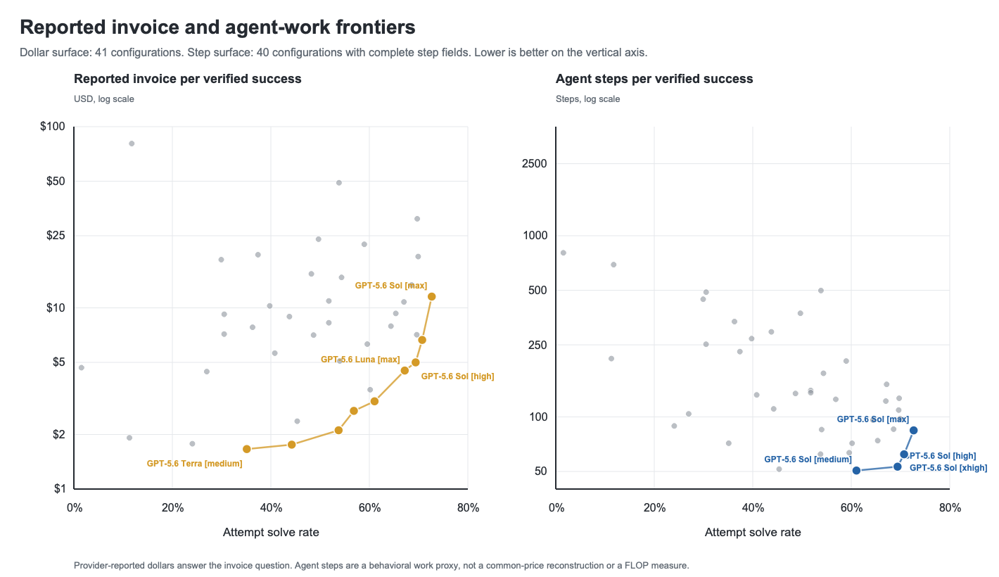
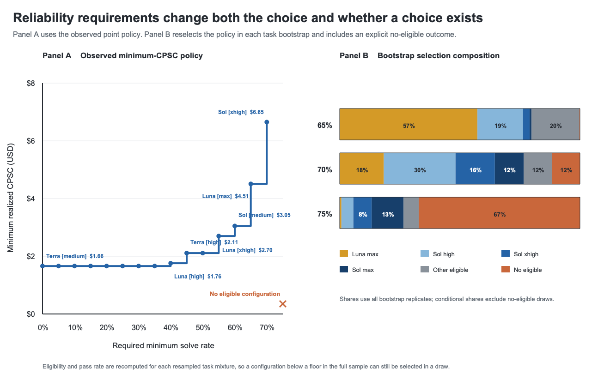

<!-- Canonical typesetting source: main.tex -->

# Failure-Aware Economics of Frontier Coding Agents

*A Cost-per-Success Reanalysis of DeepSWE v1.1*

George Lydakis  
[george@lydakis.me](mailto:george@lydakis.me)

Working paper, July 2026

## Abstract

DeepSWE ranks coding-agent capability. We ask what economic picture emerges when its trials are
analyzed as reported spend and recorded work per verified success. We analyze 18,396 scored
attempts from 41 model-effort configurations on 113 tasks. Realized cost per successful completion
(CPSC) is algebraically mean attempt cost divided by pass rate and is therefore recoverable from
aggregate leaderboard fields. Trial-level analysis nevertheless reveals three findings. First,
reported-dollar and recorded-work frontiers disagree. Nine configurations on the dollar frontier
span GPT-5.6 Luna, Terra, and Sol, whereas, among resource-complete configurations, every step- or
token-counter frontier configuration is Sol. Luna max costs 0.390 times Sol max per success while
using 1.80 times the agent steps and 2.12 times the sum of reported token counters. Against Sol
high, however, Luna's invoice difference is unresolved while Sol uses substantially less recorded
work and time. Second, within Sol, high and xhigh effort use fewer dollars and resources than max
in every task-bootstrap replicate, while their observed solve-rate deficits remain unresolved.
Third, no universal economic winner is identified: selection changes with the reliability floor
and proxy failure charge, and at high floors the feasible set is unstable or empty. Equal-task
workload weighting changes one winner exactly at a 35% eligibility boundary. The accounting lens
transports to DeepSWE, but any economic recommendation remains conditional on workload,
reliability, failure valuation, and price basis. The remaining behavioral question is whether
rising task pressure makes initially inexpensive configurations consume enough repair work or
failure consequence to reverse the economic ordering.

## 1. Introduction

DeepSWE v1.1 asks which fixed coding-agent configuration solves the largest share of 113 original,
functionally verified software-engineering tasks
([Huang et al., 2026](https://arxiv.org/abs/2607.07946)). Its public artifact also contains trial
spend, steps, tokens, and repeated attempts. This permits a different, deliberately open question:
*what happens when DeepSWE is analyzed as stochastic spend and work per verified completion?*

For configuration \(m\), realized cost per successful completion is

$$
\widehat{\operatorname{CPSC}}^{\mathrm{real}}_m
=\frac{\text{total scored spend}_m}{\text{verified successes}_m}
=\frac{\text{mean attempt cost}_m}{\widehat p_m}.
\tag{1}
$$

The identity is important. The point estimate and its rank are recoverable from DeepSWE's published
mean attempt cost and pass rate. The contribution cannot be the division itself. Trial records are
useful because they support task-paired uncertainty, task-balanced workloads, outcome-conditioned
spend, solved-task overlap, resource consumption, exclusion audits, and policy reselection.

The analysis produces a more interesting picture than either a capability rank or a price sheet.
Across all 41 configurations, the reported-invoice frontier and every recorded-work frontier select
different sets of configurations. A memorable same-provider example, Luna max versus Sol max,
shows why: Luna is much cheaper in reported dollars but consumes materially more agent steps and
reported token counters. DeepSWE therefore rules out one explanation for Luna's dollar advantage,
lower recorded resource appetite, but cannot distinguish provider pricing, serving cost, or
margins. Crucially, comparing Luna max with Sol high nearly eliminates the invoice gap while Sol
high uses far less recorded work and time. Most of the Luna-Sol-max invoice gap disappears when Sol
is evaluated at high rather than max effort, while the recorded-work and elapsed-time gap becomes
larger. Effort setting and model family therefore affect different economic surfaces. Within Sol,
high and xhigh reduce both invoice and recorded work relative to max, with an unresolved loss in
solve rate.

The economic answer is also policy-conditional. An unconstrained minimum rewards configurations
with solve rates as low as 35%. Raising the reliability requirement changes the selected
configuration and eventually leaves no eligible option. Retrospective proxy charges for failure
move the ranking again. The correct conclusion is not that DeepSWE names a new universal winner.
It is that the benchmark contains multiple economic surfaces, and that a recommendation is not
identified until an operational contract specifies the workload, reliability requirement, failure
consequence, and price basis.

This paper makes four contributions:

1. An all-family comparison of reported dollars, agent steps, and token counters per success.
2. Paired case studies separating a price-versus-work reversal from within-model effort
   overprovisioning.
3. Reliability-floor, proxy failure-charge, and task-weighting sensitivity analyses.
4. An identification audit that separates aggregate-recoverable accounting from conclusions that
   require trial records or additional benchmark design.

## 2. Related Work and Claim Boundary

### Software-engineering benchmarks

SWE-bench established repository-level issue resolution against executable tests as an evaluation
problem ([Jimenez et al., 2024](https://arxiv.org/abs/2310.06770)). DeepSWE authors tasks from
scratch across 91 repositories and five languages and grades them with purpose-built functional
verifiers ([Huang et al., 2026](https://arxiv.org/abs/2607.07946)). SWE-Lancer connects freelance
software tasks to historical payouts, measuring task-side economic value
([Miserendino et al., 2025](https://arxiv.org/abs/2502.12115)). We instead analyze model-side
benchmark spend. We do not assume that a completion has the same value across benchmarks.

### Cost-aware inference

FrugalGPT and RouteLLM study cost-quality tradeoffs through routing
([Chen et al., 2024](https://arxiv.org/abs/2305.05176);
[Ong et al., 2025](https://arxiv.org/abs/2406.18665)). Cost-of-Pass formalizes expected monetary
cost per correct solution and an economic frontier
([Erol et al., 2025](https://arxiv.org/abs/2504.13359)). Under a fixed attempt distribution,
realized CPSC is the same cost-over-success object. Coding-agent work also studies token-consumption
variance and model-level token efficiency
([Bai et al., 2026](https://arxiv.org/abs/2604.22750)). We do not claim novelty for cost divided by
success probability. The contribution here is empirical and diagnostic: transport the accounting
to an independent frontier benchmark, separate invoice from resource appetite, and identify which
economic claims remain policy-dependent.

### Claim boundary

The analysis can show that the accounting and task-clustered stability procedures behave coherently
on DeepSWE. It cannot validate a production reliability requirement, calibrated task-specific
failure values, a stateful repair policy, a common-price ranking, or production return on
investment. Exact reconciliation and tests support implementation correctness; DeepSWE supplies a
transport study, not construct or decision validation for another benchmark.

## 3. Data, Estimands, and Methods

### 3.1 Cohort, cost, and exclusions

The analysis uses content-hashed DeepSWE v1.1 artifacts frozen on July 14, 2026
([DeepSWE contributors, 2026](https://deepswe.datacurve.ai/)). The trial file contains 18,522 rows.
Requiring the DeepSWE source, full evaluation scope, and score-inclusion flag leaves 18,396 scored
attempts across 41 configurations. Model-caused timeouts and context-window failures remain scored.
We exclude 126 rows marked as infrastructure failures: 73 routing 404s, 36 provider timeouts, 11
verifier timeouts, and six other errors. Exclusions are provider-skewed and are audited separately.

Twenty-one scored rows lack `cost_usd`: 20 failed Fable rows on one task and one successful Sonnet
row. The primary analysis retains their outcomes and imputes the configuration mean cost. Frozen
sensitivities charge zero, use the configuration-outcome median, or remove the row from both
numerator and denominator. The primary pipeline reproduces all official pass rates, mean costs, and
implied CPSC values within \(3.6\times10^{-15}\).

### 3.2 Observed-attempt and equal-task estimands

Let \(Y_{mti}\in\{0,1\}\) be verified success and \(C_{mti}\geq0\) reported spend for configuration
\(m\), task \(t\), and scored attempt \(i\). With \(S_m\) successes and \(F_m\) failures,

$$
\widehat{\operatorname{CPSC}}^{\mathrm{real}}_m
=\frac{\sum_{t,i}C_{mti}}{S_m}
=\widehat\mu^S_m+\frac{F_m}{S_m}\widehat\mu^F_m,
\tag{2}
$$

where \(\widehat\mu^S_m\) and \(\widehat\mu^F_m\) are mean spend conditional on success and
failure. The second term is the realized reliability tax.

Equation (2) weights tasks by their number of surviving scored attempts. To represent a declared
equal-task workload, we also compute

$$
\widehat\Theta_m
=\frac{\sum_t w_t\,\overline C_{mt}}
       {\sum_t w_t\,\overline Y_{mt}}, \qquad w_t=1/113,
\tag{3}
$$

where each bar averages valid attempts within a task. The estimands coincide when every
configuration-task cell has the same attempt count. Here 4,520 of 4,633 cells have four attempts;
111 have one to three; and two Opus max cells are absent. We report the 113-task estimand for the 40
complete configurations, a common 111-task basket for all 41, and the observed-attempt invoice
ratio.

Realized CPSC does not identify a sequential retry policy. Attempts on a task are dependent, and
the artifact does not declare a randomized retry order or stopping rule. We also report empirical
task coverage, the share of tasks solved at least once in the observed attempts, without calling it
production pass@k.

### 3.3 Recorded work and price basis

For each recorded resource \(R\in\{\text{agent steps, input, cache, output tokens, agent seconds,
trial seconds}\}\), resource intensity is

$$
\widehat I^R_m=\frac{\sum_{t,i}R_{mti}}{S_m}.
\tag{4}
$$

We additionally sum the three reported token counters per success. These are behavioral, billing,
and elapsed-time surfaces, not harmonized compute. Tokenizers, cache semantics, reasoning-token
exposure, and service conditions may differ by model and provider, so cross-family levels are
descriptive. Of 18,396 scored rows, 18,395 contain all four step/token fields; one successful
Sonnet 5 high row lacks all four. We therefore mark that configuration's corresponding totals
undefined and exclude it from those ranks, pairwise ratios, and frontiers. Agent and trial duration
are complete for all scored rows. Reported dollars answer an invoice question under the artifact's
provider prices. They do not reveal provider cost-to-serve or margin.

### 3.4 Task-mix diagnostics and uncertainty

For every pair we compute solved-task overlap and recompute CPSC on tasks both configurations solve
at least once. This matched set conditions on outcomes and is a composition diagnostic, not a
deployment estimand. We also form panel-solvedness strata from the number of configurations that
solve each task. To examine GPT-5.6 Luna, Sol, and Terra without circularly using their outcomes to
define their own strata, the primary mechanism diagnostic excludes all 15 GPT-5.6 configurations
when assigning 20 rare, 30 contested, and 63 common tasks. The labels remain retrospective
panel-solvedness categories, not intrinsic difficulty or a preregistered pressure scale.

Uncertainty uses 10,000 task-cluster bootstrap replicates with seed 20260714. Each replicate samples
113 task IDs with replacement and retains every scored attempt for each selected task. Paired
contrasts use the same task sample, and reported 95% intervals are the 2.5th and 97.5th
percentiles. The task-balanced sensitivity recomputes task-level means, equal-task eligibility,
and policy selection after the same resampling step. Intervals therefore measure sensitivity to
suite composition, not all future tasks or rollout randomness. Reliability policies and economic
winners are reselected inside each replicate.

### 3.5 Reliability and failure-price policies

For required solve rate \(r\), the point policy is

$$
m^*(r)=\arg\min_{m:\widehat p_m\geq r}\widehat{\operatorname{CPSC}}^{\mathrm{real}}_m.
\tag{5}
$$

We evaluate \(r=0,0.05,\ldots,0.75\). We report selection frequency over all replicates and
conditional on at least one eligible configuration. These are task-mix robustness frequencies,
not posterior model probabilities.

A calibrated task-specific failure charge \(B_t\) is unavailable. We therefore run two explicitly
retrospective proxy sensitivities. The full-basket version uses median observed Sol max spend by
task. A stricter 97-task version uses median successful Sol max spend only on tasks Sol solves.
Failed attempts are charged 0.5, 1, or 2 times the proxy. These outputs are counterfactual proxy
charges, never reference-budget estimates.

## 4. Results

### 4.1 The full panel separates invoice from work

Table 1 gives one highest-pass configuration per base model. Sol max leads attempt solve rate at
72.7%; Fable xhigh follows at 69.9%. The least expensive point estimate in this descriptive panel
is Luna max at \$4.51 per success, but its 67.2% pass rate is not a substitute for a declared
reliability policy. Across the full 41-configuration menu, unconstrained Terra medium minimizes
CPSC at \$1.66 with only 35.1% pass rate.

**Table 1. Highest-pass observed configuration per base model.** Selection is post-outcome and the
table is descriptive. The last column sums input, cache, and output counters in millions per
success; it is not a harmonized compute quantity.

| Model | Provider | Effort | Pass | CPSC | Steps/success | Sum counters/success |
|---|---|---:|---:|---:|---:|---:|
| GPT-5.6 Sol | OpenAI | max | 72.7% | \$11.54 | 84 | 21.2M |
| Claude Fable 5 | Vertex AI | xhigh | 69.9% | \$19.19 | 98 | 20.8M |
| GPT-5.6 Terra | OpenAI | max | 69.6% | \$7.10 | 109 | 25.8M |
| GPT-5.6 Luna | OpenAI | max | 67.2% | \$4.51 | 151 | 44.9M |
| GPT-5.5 | OpenAI | xhigh | 67.0% | \$10.78 | 122 | 24.5M |
| Claude Opus 4.8 | Anthropic | max | 59.0% | \$22.42 | 203 | 57.7M |
| Claude Sonnet 5 | Anthropic | max | 53.8% | \$49.03 | 499 | 268.6M |
| GPT-5.4 | OpenAI | xhigh | 51.8% | \$10.92 | 136 | 35.0M |
| GLM-5.2 | Z.ai | max | 43.8% | \$8.95 | 295 | 57.2M |
| Gemini 3.5 Flash | Vertex AI | medium | 37.4% | \$19.64 | 229 | 87.2M |
| Kimi K2.7 Code | OpenRouter | default | 30.5% | \$9.22 | 488 | 84.9M |
| Claude Sonnet 4.6 | Anthropic | high | 29.9% | \$18.45 | 447 | 85.7M |
| Gemini 3.1 Pro Preview | Vertex AI | high | 11.8% | \$80.68 | 693 | 98.8M |

The all-configuration Pareto surfaces are more revealing than a single rank. Nine configurations
are nondominated in pass rate versus reported CPSC, spanning GPT-5.6 Luna, Terra, and Sol. In
contrast, the four step-per-success frontier configurations are all Sol; every input-, output-,
cache-, or summed-token frontier point is also Sol. Figure 1 visualizes the first two surfaces. A
configuration can be invoice-efficient without minimizing recorded agent work.

**Figure 1.** Pass rate versus reported-dollar CPSC (left) and agent steps per success (right) for
all 41 configurations. Colored points are nondominated within each surface. The frontier changes
when dollars are replaced by recorded work. Dollar comparisons use reported provider prices;
steps are not harmonized compute.

This finding is not a claim that Sol is intrinsically cheaper to serve. It is a decomposition of
what the artifact can identify. Dollar efficiency equals observed resource appetite filtered
through provider-specific units and prices. The data measure both sides imperfectly, but they are
sufficient to reject the idea that one universal notion of "efficiency" explains the ranking.

### 4.2 Luna-Sol is a price-versus-work reversal

Table 2 compares Luna max with capability-leading Sol max. The point solve-rate gap is -5.5
percentage points, with paired task-bootstrap interval [-12.1, +1.1]; this is unresolved, not
evidence of equivalence. Luna's CPSC ratio is 0.390 [0.345, 0.439], and Luna is cheaper in all
10,000 task-mix replicates. Yet Luna consumes materially more of every displayed step/token
counter per success. Its trial-seconds ratio, 1.08 [0.97, 1.20], is unresolved. The result is an
invoice advantage, not a lower-recorded-work advantage.

**Table 2. Luna max versus Sol max.** Ratio intervals are paired 95% task-cluster bootstrap
intervals. A ratio below one favors Luna.

| Metric | Luna max | Sol max | Luna/Sol contrast |
|---|---:|---:|---:|
| Attempt solve rate | 67.2% | 72.7% | -5.5 pp [-12.1, +1.1] |
| Any-success task coverage | 102/113 | 97/113 | descriptive +5 tasks |
| Reported CPSC | \$4.51 | \$11.54 | 0.390 [0.345, 0.439] |
| Agent steps/success | 151 | 84 | 1.80 [1.62, 1.99] |
| Input counter/success | 23.0M | 10.9M | 2.11 [1.87, 2.38] |
| Output counter/success | 0.109M | 0.083M | 1.32 [1.20, 1.46] |
| Sum of counters/success | 44.9M | 21.2M | 2.12 [1.88, 2.39] |
| Trial seconds/success | 1,830 | 1,693 | 1.08 [0.97, 1.20] |

The solved-task composition does not erase the reversal. Luna and Sol solve 92 tasks in common
(Jaccard overlap 0.86). On that post-outcome intersection, Luna's CPSC is \$3.88 versus Sol's
\$9.72, while Sol's solve rate is higher, 85.8% versus 77.2%. This is a diagnostic, not a policy
for unseen tasks.

The noncircular GPT-5.6 group-out strata also do not support a simple "Luna solves only the easy
subset" story. On the 20 tasks deemed rare by the other 26 configurations, Luna succeeds on 39 of
80 attempts and reaches 16 tasks; Sol succeeds on 34 of 80 and reaches 11. Luna's CPSC is \$8.36
versus Sol's \$21.41. Sol leads attempt solve rate on the contested and common strata, while Luna
remains cheaper in dollars in all three. With only four attempts per task, the rare-stratum
coverage difference is suggestive rather than a resolved behavioral mechanism. The public
artifact does not provide enough accessible trajectory content to test whether Luna's coverage
comes from greater strategy diversity.

What explains the dollar reversal? The data answer only part of the question. Luna does more
recorded work, so lower resource consumption is not the mechanism. The residual necessarily lies
in how those resources map to reported dollars, including model-specific unit prices, cache rules,
and unobserved token categories. Provider cost-to-serve, parameter count, utilization, and margin
are absent. Those are plausible explanations, not findings.

### 4.3 Sol max's cost premium is resolved; its solve-rate gain is not

Within one model and provider, Sol high, xhigh, and max offer a cleaner effort comparison (Table
3). Max has the highest point solve rate. However, paired task-bootstrap intervals for
high-minus-max ([-7.7, +1.1] points) and xhigh-minus-max ([-5.6, +1.7]) include zero. Meanwhile
high and xhigh are cheaper than max in every replicate and use fewer steps, reported token
counters, and accumulated seconds with all paired ratio intervals below one.

**Table 3. Effort-tuned comparison.** The counter column sums reported input, cache, and output
counters; seconds are accumulated trial duration per verified success.

| Configuration | Pass | CPSC | Steps/success | Sum counters/success | Trial s/success |
|---|---:|---:|---:|---:|---:|
| Luna max | 67.2% | \$4.51 | 151 | 44.9M | 1,830 |
| Sol high | 69.4% | \$5.00 | 53 | 7.5M | 1,004 |
| Sol xhigh | 70.7% | \$6.65 | 62 | 11.7M | 1,273 |
| Sol max | 72.7% | \$11.54 | 84 | 21.2M | 1,693 |

The correct interpretation is asymmetric. The additional dollar and recorded-resource cost of max
is strongly resolved under suite resampling; its solve-rate advantage is not. The data do not prove
the configurations equivalent, and a larger evaluation could resolve the capability difference.
For this suite, maximum effort appears economically overprovisioned unless a decision maker values
the unresolved point advantage enough to pay the premium.

The effort-tuned cross-model comparison changes the headline gap. Luna max versus Sol high has a
CPSC ratio of 0.901 [0.798, 1.018], which crosses parity, and a solve-rate difference of -2.2
points [-8.6, +4.0]. Sol high uses 0.35 times the steps [0.32, 0.39], 0.17 times the sum of
reported counters [0.15, 0.19], and 0.55 times the trial seconds [0.49, 0.61]. Thus the dramatic
Luna-Sol-max invoice gap is partly an effort-overprovisioning result. Most of that invoice gap
disappears when Sol is evaluated at high rather than max effort, while the recorded-work and
elapsed-time gap becomes larger. Effort setting and model family therefore affect different
economic surfaces.

### 4.4 Realized failure tax adds little beyond failure rate

Across configurations, mean failed-attempt spend is 0.72 to 1.23 times mean successful-attempt
spend, with median 1.02. The realized reliability-tax share therefore correlates 0.995 with failure
rate. Under DeepSWE's fixed attempt policy, failures usually consume about as much reported spend
as successes. The decomposition is correct and useful for auditing, but its share is mostly a
rescaling of unreliability rather than an independent behavioral signal. An exogenous failure
consequence could behave differently; DeepSWE does not identify one.

## 5. Why the Economic Winner Is Policy-Conditional

### 5.1 Reliability changes the feasible set

The unconstrained point minimum, Terra medium, passes 35.1% of attempts. As the floor in Equation
(5) increases, the point winner moves through Terra, Luna, and Sol configurations. At 65%, Luna
max minimizes observed CPSC; at 70%, Sol xhigh does; no point estimate reaches 75%.

Bootstrap reselection shows that high-reliability decisions are unstable. At 70%, Sol xhigh is
selected in 16.4% of all replicates, or 18.5% conditional on a nonempty feasible set. Sol high is
selected most often at 29.9% of all replicates, or 33.8% conditionally, and 11.7% have no eligible
configuration. Sol high can be selected despite its 69.4% full-sample pass rate because pass rate
and eligibility are recomputed on each resampled task mixture. At 75%, 67.1% have no eligible
configuration; Sol max is selected in 13.3% of all replicates and 40.3% of nonempty ones. These
frequencies combine uncertain eligibility near a hard threshold with uncertain CPSC ordering. They
should not be read as posterior probabilities that a model is best.

**Figure 2.** Exploratory reliability-floor analysis. Panel A shows the observed point policy.
Panel B shows selection shares over all task-bootstrap replicates at high floors, including
no-eligible draws. No configuration reaches a 75% point floor.

This is the central identification result. DeepSWE supports economic rankings, but it does not
identify an economical configuration that satisfies an unspecified production reliability
contract. At sufficiently high floors, it may identify no feasible configuration at all.

### 5.2 Failure valuation changes the ordering

The full-basket proxy failure-charge sensitivity selects Sol medium at 0.5x and Luna max at 1x and
2x. The stricter Sol-solved 97-task variant moves the full-panel rank association toward capability
rank as the charge grows. Its point minimum is Sol medium at 0.5x and 1x, then Sol high at 2x.
Luna remains less expensive than Sol max at every tested multiplier: \$4.45 versus \$9.09 at 0.5x,
\$5.90 versus \$9.83 at 1x, and \$8.79 versus \$11.30 at 2x.

These two proxy constructions answer different counterfactuals and are intentionally kept
separate. Neither is a calibrated reference budget. They show that charging failure can materially
reorder the panel while the Luna-Sol pairwise reversal survives the tested Sol-favorable charges.

### 5.3 Equal-task weighting is required but nearly benign here

Observed-attempt pooling slightly overweights cells with four surviving attempts. Under the
113-task equal-weight estimand, the largest CPSC change is 2.58% for Luna max. No relative order
among the 40 full-basket configurations changes, and the pass-rate/mean-attempt-cost frontier is
identical. On the common 111-task basket, only Luna low and Luna max swap adjacent CPSC ranks.

One policy boundary does change. At an exact 35% floor, pooled pass rate makes Terra medium eligible
at 35.11%, while equal-task pass rate is 34.96%; the equal-task winner is therefore Luna high.
Every other five-point floor-grid winner agrees. The sensitivity does not overturn the paper, but
it confirms that a declared workload estimator is necessary when eligibility is discontinuous.

The task-balanced bootstrap reaches the same high-floor conclusion. At 70%, 12.6% of replicates
have no eligible configuration; at 75%, 67.8% do. Conditional selection frequencies move
slightly, not qualitatively.

### 5.4 Cross-provider price comparisons remain soft

The artifact reports dollars across OpenAI, Anthropic, Vertex AI, Z.ai, and OpenRouter routes, but
does not expose a dated, harmonized price sheet with consistent input, cache, output, and reasoning
token semantics. A valid common-price reconstruction would need to reprice every candidate and any
failure anchor before recomputing all metrics. We therefore report cross-provider invoice and
resource surfaces as descriptive and keep the strongest causal language within a model or provider.

Missing-cost rules preserve the qualitative results. Charging all 126 infrastructure exclusions as
failures, with missing exclusion spend imputed at the configuration mean, changes no CPSC rank, no
attempt-cost frontier membership, and no winner on the tested five-point reliability grid.
Exclusions remain uneven across providers, so the audit is reported rather than dismissed. The
release artifact also does not encode model licensing, so the analysis compares named families and
routes rather than making open-source versus proprietary claims.

## 6. Implications for Benchmark Design

The reanalysis supports transport of a failure-aware accounting layer, but it also exposes four
requirements for an economic benchmark:

1. **Declare the workload.** Equal-task, category-weighted, and observed-invoice estimands answer
   different questions when cells are incomplete.
2. **Declare reliability eligibility.** An unconstrained minimum can recommend a policy that fails
   most attempts, while a stringent floor can leave the feasible set empty.
3. **Value failure exogenously.** Observed failed spend is not the business consequence of a failed
   task. Any proxy charge should be named and stress-tested as such.
4. **Separate price from work.** Dollars, steps, tokens, latency, and compute are distinct surfaces.
   Provider prices are valid for buyer-invoice questions but not evidence of intrinsic
   computational efficiency.

DeepSWE's independent attempts leave one useful behavioral question open. Luna's higher observed
task coverage may reflect greater attempt-level strategy diversity, while Sol's higher attempt pass
rate may reflect more consistent convergence. A bounded same-context repair loop is a different
process from four independent attempts and could favor either behavior. Testing that mechanism
requires accessible trajectories, predeclared stopping rules, and enough replications to separate
rollout variance from task-mix variance.

The economic hypothesis worth testing in a separately designed workload is not that small or cheap
models must win easy tasks. It is conditional: as calibrated task pressure rises, do initially
inexpensive models consume enough additional repair work or failure consequence that a larger model
becomes cheaper per reliable completion? DeepSWE does not exhibit the required repair protocol or
failure valuation, so it motivates that question without answering it.

## 7. Limitations

### Retrospective analysis

The public leaderboard and some aggregate inversions were inspected before the analysis plan froze.
Reliability policies, resource surfaces, group-out strata, and equal-task sensitivity are logged
result-informed amendments. The paper is an auditable exploratory reanalysis, not a blinded
confirmatory study.

### Four independent attempts

The design does not identify an infinite-retry process, a same-context repair loop, or a sequential
stopping policy. Coverage and panel-solvedness are observed-sample summaries. Four attempts per task
are too sparse to establish mechanisms such as strategy diversity.

### Task and model generalization

The bootstrap varies the composition of these 113 tasks. It does not cover new repositories, future
model versions, provider changes, or production workloads. Highest-pass model rows and Pareto
frontiers are selected on the same data used to describe them. Because the tasks span 91
repositories, task-level resampling also does not model possible dependence among multiple tasks
from the same repository; a repository-cluster sensitivity remains future work.

### Price and resource semantics

Reported dollars mix behavior with provider prices and cache rules. Steps are a harness-level
proxy, not FLOPs. Recorded durations are observed elapsed-time totals, not throughput under a
common concurrency or service condition. Token counters may not be harmonized across providers.
The analysis cannot infer model size, cost-to-serve, or provider margin.

### Failure value

Retrospective Sol-derived charges are sensitivity devices, not calibrated task budgets. DeepSWE
does not observe the operational consequence of an unresolved task or the cost of replacement by a
human or fallback model.

## 8. Conclusion

Applying failure-aware economics to DeepSWE reveals more than a cheaper leaderboard, but less than
a universal winner. Realized CPSC itself is aggregate-recoverable. Trial-level records matter
because they show that reported-dollar and recorded-work frontiers disagree, that the Luna-max
invoice advantage over Sol max coexists with greater step and token-counter appetite, and that the
gap nearly vanishes when Sol is tuned to high effort. Within Sol, max's additional dollar,
resource, and time costs are resolved while its point solve-rate gain is not.

The same records show why the answer is conditional. Reliability floors change the selected
configuration and can empty the feasible set. Proxy failure charges move the ranking. Equal-task
weighting is numerically modest here but changes one exact threshold decision. Cross-provider
prices do not identify intrinsic efficiency. The empirical conclusion is therefore an
identification statement: economic ranking is well-defined only relative to an operational
contract specifying workload, reliability, failure value, and price basis.

## References

- Bai, Longju, Zhemin Huang, Xingyao Wang, Jiao Sun, Rada Mihalcea, Erik Brynjolfsson, Alex
  Pentland, and Jiaxin Pei. 2026. "How Do AI Agents Spend Your Money? Analyzing and Predicting
  Token Consumption in Agentic Coding Tasks." *arXiv preprint arXiv:2604.22750*.
  <https://arxiv.org/abs/2604.22750>
- Chen, Lingjiao, Matei Zaharia, and James Zou. 2024. "FrugalGPT: How to Use Large Language Models
  While Reducing Cost and Improving Performance." *Transactions on Machine Learning Research*.
  <https://arxiv.org/abs/2305.05176>
- DeepSWE contributors. 2026. "DeepSWE v1.1 Leaderboard and Trial Artifacts." Benchmark data
  release. Artifact contents frozen by SHA-256; accessed July 14, 2026.
  <https://deepswe.datacurve.ai/>
- Erol, Mehmet Hamza, Batu El, Mirac Suzgun, Mert Yuksekgonul, and James Zou. 2025. "Cost-of-Pass:
  An Economic Framework for Evaluating Language Models." *arXiv preprint arXiv:2504.13359*.
  <https://arxiv.org/abs/2504.13359>
- Huang, Wenqi, Charley Lee, Leonard Tng, and Serena Ge. 2026. "DeepSWE: Measuring Frontier Coding
  Agents on Original, Long-Horizon Engineering Tasks." *arXiv preprint arXiv:2607.07946*.
  <https://arxiv.org/abs/2607.07946>
- Jimenez, Carlos E., John Yang, Alexander Wettig, Shunyu Yao, Kexin Pei, Ofir Press, and Karthik
  Narasimhan. 2024. "SWE-bench: Can Language Models Resolve Real-World GitHub Issues?"
  *International Conference on Learning Representations*. <https://arxiv.org/abs/2310.06770>
- Miserendino, Samuel, Michele Wang, Tejal Patwardhan, and Johannes Heidecke. 2025. "SWE-Lancer:
  Can Frontier LLMs Earn \$1 Million from Real-World Freelance Software Engineering?" *arXiv
  preprint arXiv:2502.12115*. <https://arxiv.org/abs/2502.12115>
- Ong, Isaac, Amjad Almahairi, Vincent Wu, Wei-Lin Chiang, Tianhao Wu, Joseph E. Gonzalez, M. Waleed
  Kadous, and Ion Stoica. 2025. "RouteLLM: Learning to Route LLMs with Preference Data."
  *International Conference on Learning Representations*. <https://arxiv.org/abs/2406.18665>

## Appendix A. Reproducibility and Frozen Artifacts

The historical A1-A3 plan is preserved byte-for-byte in
[`configs/deepswe-cpsc-v0.1.json`](../../configs/deepswe-cpsc-v0.1.json), with its retrospective
specification in [`docs/deepswe-cpsc-preanalysis.md`](../../docs/deepswe-cpsc-preanalysis.md). The
executable A1-A5 plan is
[`configs/deepswe-cpsc-v0.2.json`](../../configs/deepswe-cpsc-v0.2.json); the dated amendment ledger
is [`docs/deepswe-cpsc-amendments-v0.2.md`](../../docs/deepswe-cpsc-amendments-v0.2.md). Both plans
record the input SHA-256 identities. The deterministic pipeline verifies the trial and leaderboard
hashes, reconciles official aggregates, runs the 10,000-replicate bootstrap, and hashes generated
tables and figures in a manifest. Commands are in [`README.md`](README.md). A public URL and exact
implementation commit will be added before circulation; none is asserted for uncommitted analysis
code.
